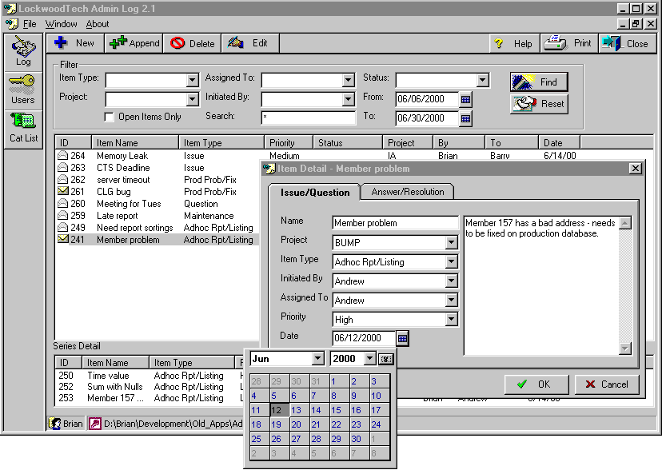



## Floating Calendar control

### Description

Provides a "floating" calendar control that you can doc next to text boxes. It's a wrapper for MS Cal Control 8.0 that provides some value added and fixed an annoying bug. Updated to show use with MS Masked Edit control as well.
 
### More Info
 
Requires MS Cal Control 8.0 - might not have it unless you have installed MS Access

This is an .ocx that sits on a form. You doc the form next to an edit box.

             |
---                |---
**Submitted On**   |2000-07-29 14:08:12
**By**             |[Brian Lockwood](https://github.com/Planet-Source-Code/PSCIndex/blob/master/ByAuthor/brian-lockwood.md)
**Level**          |Intermediate
**User Rating**    |4.6 (23 globes from 5 users)
**Compatibility**  |VB 5\.0, VB 6\.0
**Category**       |[Miscellaneous](https://github.com/Planet-Source-Code/PSCIndex/blob/master/ByCategory/miscellaneous__1-1.md)
**World**          |[Visual Basic](https://github.com/Planet-Source-Code/PSCIndex/blob/master/ByWorld/visual-basic.md)
**Archive File**   |[CODE\_UPLOAD83317292000\.zip](https://github.com/Planet-Source-Code/brian-lockwood-floating-calendar-control__1-10177/archive/master.zip)

